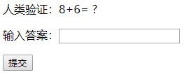

# Scode

## 简介

```
和传统的验证码没什么区别，个人感觉这个更简介更实用。
```

### 示例
* 展示

* 验证失败

* 验证通过


## Features
* Vue.js
* Bootstrap 4
* Webpack
* Responsive layout
* Charts (Chart.js)
* Maps (Google, Leaflet, amMap)
* Progress bars
* Material forms with beautiful validation
* 4 Form wizard types
* Static tables and datatables
* Login/signup pages templates
* Medium editor
* Toasts, tooltips, popovers,
* i18n
* and many more!
